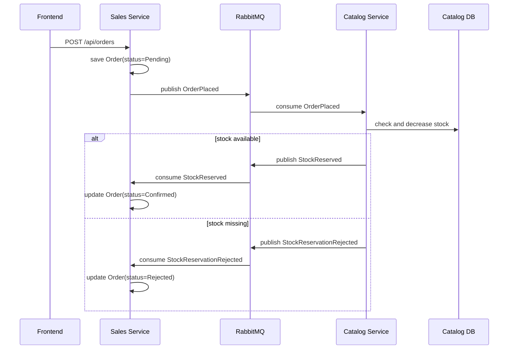

# Projekt podzialu monolitu `Pawelkoz201/sklep` na mikrouslugi

## 1. Punkt wyjscia: obecny monolit

Analizowany projekt to sklep internetowy napisany w ASP.NET Core z frontendem React/Vite. Backend dziala jako jeden monolit i korzysta z jednej wspolnej bazy SQLite skonfigurowanej jako:

```json
"SklepContext": "Data Source=sklep.db"
```

W jednym `SklepContext` znajduja sie wszystkie glowne encje:

- `Users`
- `Products`
- `Categories`
- `Carts`
- `CartItems`
- `Orders`
- `OrderItems`

Najsilniejsze sprzezenia widac w:

- `UsersController`, gdzie obsluga uzytkownika, logowania i koszyka znajduje sie w jednym kontrolerze.
- `OrdersController`, gdzie skladanie zamowienia pobiera jednoczesnie uzytkownika, koszyk, pozycje koszyka i produkty z jednej bazy.
- modelach `CartItem` i `OrderItem`, ktore maja bezposrednia nawigacje EF do `Product`.

To oznacza, ze obecny system jest tight coupled: koszyk i zamowienia nie moga dzialac niezaleznie od tabel produktow, a wszystkie konteksty sa zalezne od jednej bazy danych.

## 2. Proponowane bounded contexty

Na podstawie kodu repozytorium wyodrebniam nastepujace konteksty:

| Bounded Context | Obecny kod w monolicie | Odpowiedzialnosc |
| --- | --- | --- |
| Identity | `UsersController` register/login, `User`, `TokenService` | rejestracja, logowanie, JWT, dane konta |
| Catalog | `ProductsController`, `CategoriesController`, `Product`, `Category` | produkty, kategorie, ceny, stany magazynowe |
| Sales | `OrdersController`, czesc koszyka z `UsersController`, `Cart`, `Order` | koszyk, checkout, zamowienia, historia zamowien |

Minimalnie zadanie wymaga co najmniej dwoch mikrouslug. W tym projekcie sensowny podzial to trzy uslugi, bo `UsersController` laczy obecnie autoryzacje i koszyk, czyli dwie rozne odpowiedzialnosci.

## 3. Fizyczny podzial na mikrouslugi

### 3.1. Identity Service

**Kod przenoszony z monolitu:**

- `TokenService`
- `User`
- DTO: `Register`, `Login`
- endpointy:
  - `POST /api/auth/register`
  - `POST /api/auth/login`
  - `GET /api/users/{id}`

**Wlasnosc danych:**

Identity Service jest jedynym wlascicielem danych uzytkownikow. Inne uslugi nie maja dostepu do jego bazy. W komunikacji uzywaja tylko `userId` z tokena JWT.

**Baza danych:**

- PostgreSQL
- baza: `identity_db`
- tabele: `users`

### 3.2. Catalog Service

**Kod przenoszony z monolitu:**

- `ProductsController`
- `CategoriesController`
- `Product`
- `Category`

**Endpointy:**

- `GET /api/products`
- `GET /api/products/{id}`
- `GET /api/products/category/{categoryId}`
- `POST /api/products`
- `PUT /api/products/{id}`
- `DELETE /api/products/{id}`
- `GET /api/categories`

**Wlasnosc danych:**

Catalog Service jest jedynym wlascicielem produktu, kategorii, ceny i stanu magazynowego. Sales Service nie czyta tabel produktow bezposrednio.

**Baza danych:**

- PostgreSQL
- baza: `catalog_db`
- tabele: `products`, `categories`

### 3.3. Sales Service

**Kod przenoszony z monolitu:**

- czesc koszykowa z `UsersController`
- `OrdersController`
- `Cart`, `CartItem`
- `Order`, `OrderItem`

**Endpointy:**

- `GET /api/cart`
- `POST /api/cart/items`
- `PUT /api/cart/items/{productId}`
- `DELETE /api/cart/items/{productId}`
- `POST /api/orders`
- `GET /api/orders`
- `GET /api/orders/{orderId}`

**Wlasnosc danych:**

Sales Service jest wlascicielem koszykow i zamowien. Nie trzyma relacji EF do `Product` ani `User`. Zamiast tego uzywa:

- `userId` z JWT
- `productId`
- lokalnego read modelu produktu, aktualizowanego zdarzeniami z Catalog Service

**Bazy danych:**

- Redis jako magazyn koszyka: `cart:{userId}`
- MongoDB jako magazyn zamowien i read modeli: `orders`, `product_snapshots`

Dzieki temu spelniony jest warunek polyglot persistence:

- Catalog i Identity uzywaja relacyjnego PostgreSQL.
- Sales uzywa MongoDB oraz Redis jako magazynow NoSQL.

## 4. Usuniecie wspolnej bazy danych

Obecnie jedna baza SQLite przechowuje wszystko:

```text
sklep.db
  Users
  Products
  Categories
  Carts
  CartItems
  Orders
  OrderItems
```

Po podziale:

```text
identity-db
  users

catalog-db
  products
  categories

sales-redis
  cart:{userId}

sales-mongo
  orders
  product_snapshots
  integration_events_inbox
```

Najwazniejsza zmiana modelu:

```csharp
// Monolit
public class OrderItem
{
    public int ProductId { get; set; }
    public Product Product { get; set; }
}
```

Po podziale:

```csharp
// Sales Service
public class OrderItem
{
    public int ProductId { get; set; }
    public string ProductNameSnapshot { get; set; }
    public decimal UnitPriceSnapshot { get; set; }
    public int Quantity { get; set; }
}
```

Sales Service nie robi juz `Include(oi => oi.Product)`, bo produkt znajduje sie w innej usludze i innej bazie.

## 5. Komunikacja event-driven

Po rozdzieleniu baz synchroniczne zapytania do wspolnych tabel zostaja zastapione zdarzeniami przez RabbitMQ.

### 5.1. Glowne zdarzenia domenowe

| Zdarzenie | Publikuje | Odbiera | Cel |
| --- | --- | --- | --- |
| `ProductCreated` | Catalog | Sales | dodanie produktu do read modelu |
| `ProductUpdated` | Catalog | Sales | aktualizacja nazwy, ceny, zdjecia |
| `ProductDeleted` | Catalog | Sales | oznaczenie produktu jako niedostepnego |
| `StockChanged` | Catalog | Sales | aktualizacja lokalnego widoku stanu |
| `OrderPlaced` | Sales | Catalog | prosba o rezerwacje lub zmniejszenie stanu |
| `StockReserved` | Catalog | Sales | potwierdzenie zamowienia |
| `StockReservationRejected` | Catalog | Sales | odrzucenie zamowienia z powodu braku stanu |
| `OrderConfirmed` | Sales | inne uslugi | zamowienie przyjete |
| `OrderCancelled` | Sales | inne uslugi | zamowienie anulowane |

### 5.2. Przykladowy kontrakt zdarzenia

```json
{
  "eventId": "b7aa7c0b-9e5d-4ff1-90d3-7d81fc7d25c2",
  "eventType": "ProductUpdated",
  "eventVersion": 1,
  "occurredAt": "2026-06-05T19:00:00Z",
  "aggregateId": "product-12",
  "payload": {
    "productId": 12,
    "name": "Monstera deliciosa",
    "price": 89.99,
    "imageUrl": "http://catalog-service/productimg/monstera.jpg",
    "stockQuantity": 15,
    "categoryId": 1
  }
}
```

### 5.3. RabbitMQ

Proponowana konfiguracja:

```text
exchange: catalog.events
  routing keys:
    product.created
    product.updated
    product.deleted
    stock.changed

exchange: sales.events
  routing keys:
    order.placed
    order.confirmed
    order.cancelled

queues:
  sales.product-readmodel
  catalog.order-events
```

## 6. CQRS

W monolicie jeden model EF sluzy jednoczesnie do zapisu i odczytu. Po podziale stosujemy CQRS.

### 6.1. Catalog Service

**Commands:**

- `CreateProduct`
- `UpdateProduct`
- `DeleteProduct`
- `ChangeStock`

**Queries:**

- `GetProducts`
- `GetProductById`
- `GetProductsByCategory`

Po kazdej zmianie produktu Catalog zapisuje swoja baze i publikuje zdarzenie, np. `ProductUpdated`.

### 6.2. Sales Service

**Commands:**

- `AddItemToCart`
- `UpdateCartItem`
- `RemoveCartItem`
- `PlaceOrder`
- `ConfirmOrder`
- `RejectOrder`

**Queries:**

- `GetCart`
- `GetOrders`
- `GetOrderDetails`

Sales Service ma lokalna kolekcje `product_snapshots`, aktualizowana przez zdarzenia z Catalog Service. Dzieki temu endpoint historii zamowien moze pokazac nazwe i cene produktu bez synchronicznego pytania Catalog Service.

## 7. Eventual consistency: scenariusz

### Skladanie zamowienia

1. Uzytkownik wysyla `POST /api/orders` do Sales Service.
2. Sales Service tworzy zamowienie ze statusem `Pending` w MongoDB.
3. Sales Service publikuje zdarzenie `OrderPlaced`.
4. Catalog Service odbiera `OrderPlaced` i sprawdza stan magazynowy w swojej bazie PostgreSQL.
5. Jesli towar jest dostepny:
   - Catalog zmniejsza `StockQuantity`.
   - Catalog publikuje `StockReserved` oraz `StockChanged`.
   - Sales odbiera `StockReserved` i zmienia status zamowienia na `Confirmed`.
6. Jesli towaru brakuje:
   - Catalog publikuje `StockReservationRejected`.
   - Sales zmienia status zamowienia na `Rejected`.
7. Przez krotki czas zamowienie moze miec status `Pending`. To jest demonstracja eventual consistency.



## 8. Struktura repozytorium po podziale

Proponowana docelowa struktura:

```text
sklep/
  services/
    identity-service/
      Controllers/AuthController.cs
      Models/User.cs
      Services/TokenService.cs
      Dockerfile

    catalog-service/
      Controllers/ProductsController.cs
      Controllers/CategoriesController.cs
      Models/Product.cs
      Models/Category.cs
      Infrastructure/CatalogDbContext.cs
      IntegrationEvents/ProductEvents.cs
      Dockerfile

    sales-service/
      Controllers/CartController.cs
      Controllers/OrdersController.cs
      Models/Cart.cs
      Models/Order.cs
      Models/ProductSnapshot.cs
      Consumers/ProductEventsConsumer.cs
      Consumers/StockEventsConsumer.cs
      IntegrationEvents/OrderEvents.cs
      Dockerfile

  sklep-frontend/
  docker-compose.yml
```

## 9. Zmiany w API frontendu

Obecnie frontend uzywa jednego adresu:

```ts
const API_URL = 'http://localhost:5000/api';
```

Po podziale najprosciej dodac API Gateway, zeby frontend nadal mial jeden adres:

```text
http://localhost:8080/api/products      -> catalog-service
http://localhost:8080/api/categories    -> catalog-service
http://localhost:8080/api/auth          -> identity-service
http://localhost:8080/api/cart          -> sales-service
http://localhost:8080/api/orders        -> sales-service
```

Wtedy frontend zmienia tylko:

```ts
const API_URL = 'http://localhost:8080/api';
```

## 10. Konteneryzacja

Kazda usluga powinna miec osobny `Dockerfile`, osobny proces i osobne zmienne srodowiskowe. Przykladowy sklad systemu:

- `identity-service`
- `catalog-service`
- `sales-service`
- `frontend`
- `rabbitmq`
- `identity-db`
- `catalog-db`
- `sales-mongo`
- `sales-redis`
- `api-gateway`

Przykladowy plik znajduje sie w `docker-compose.microservices.yml`.

## 11. Kryteria zaliczenia

Projekt spelnia wymagania zadania:

- wyodrebnia wiecej niz dwie mikrouslugi z istniejacego monolitu,
- usuwa wspolna baze SQLite,
- kazda mikrousluga ma wlasny magazyn danych,
- stosuje polyglot persistence: PostgreSQL + MongoDB + Redis,
- zastępuje wspolne zapytania do bazy zdarzeniami przez RabbitMQ,
- pokazuje CQRS przez oddzielne komendy, zapytania i read model `product_snapshots`,
- demonstruje eventual consistency przy skladaniu zamowienia,
- zawiera gotowa koncepcje konteneryzacji przez `docker-compose`.

